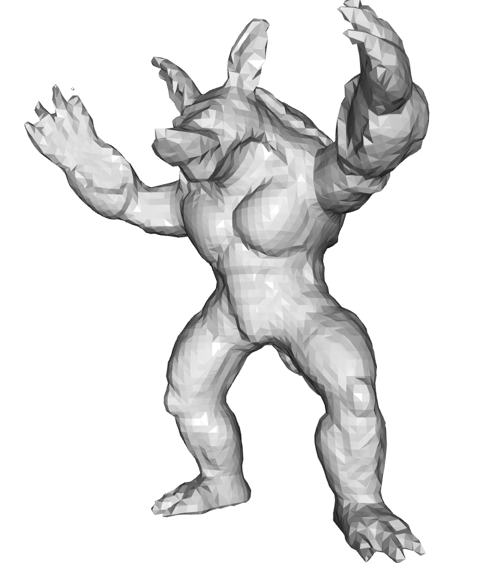
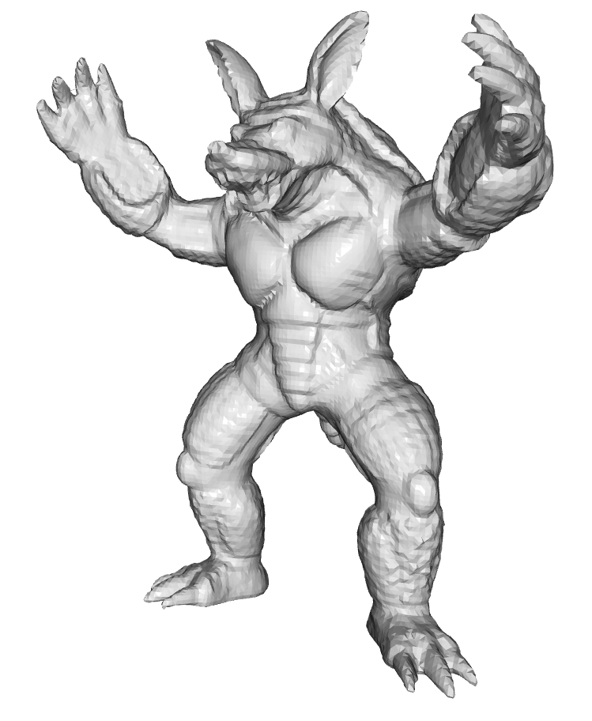

# 🧊 Marching Cubes + GeomNet Surface Reconstruction

This mini-project explores **surface reconstruction** from 3D point clouds using:

- A simple **Signed Distance Function (SDF)** computed from normals
- The **Marching Cubes** algorithm to generate a mesh
- (Optional) A neural network-based reconstruction method like **GeomNet**
<table>
  <tr>
    <td align="center">
      <br/>
      <sub>Résolution 64³</sub>
    </td>
    <td align="center">
      <br/>
      <sub>Résolution 128³</sub>
    </td>
  </tr>
</table>
---

## 📁 Structure

- `src/reconstruction.py` : Main pipeline — normalization, KDTree, SDF, Marching Cubes
- `data/` : Example point cloud (with normals)
- `exports/` : Sample output (`.obj`)
- `notebooks/demo.ipynb` : Google Colab-friendly notebook version

---

## 🚀 Quickstart

### 1. Install requirements

```bash
pip install -r requirements.txt
```
### 2. Run the reconstruction
```bash
python src/reconstruction.py --input data/sample_pointcloud.txt --output exports/result.obj
```
### 🛠️ Dependencies
numpy
scipy
scikit-image
open3d
Optional (for GeomNet):
torch
torchvision
### 🧠 About GeomNet
If you activate GeomNet, the system replaces the classic SDF with a learned implicit function for better reconstruction on noisy or sparse clouds

## 📦 Dataset

📥 [Download via Google Drive](https://drive.google.com/file/d/19RXyfxno2OUtCPDOVC9p1yhROWgok5Jv/view?usp=drive_link)

